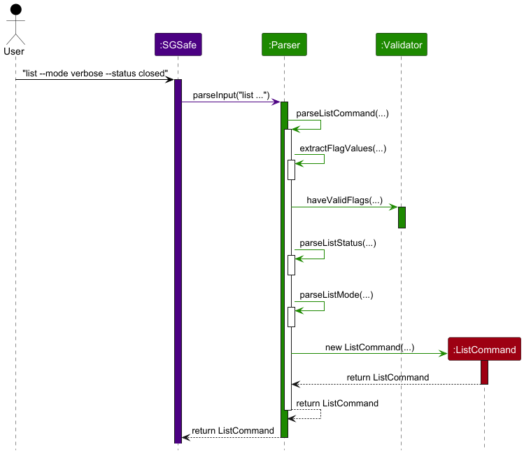
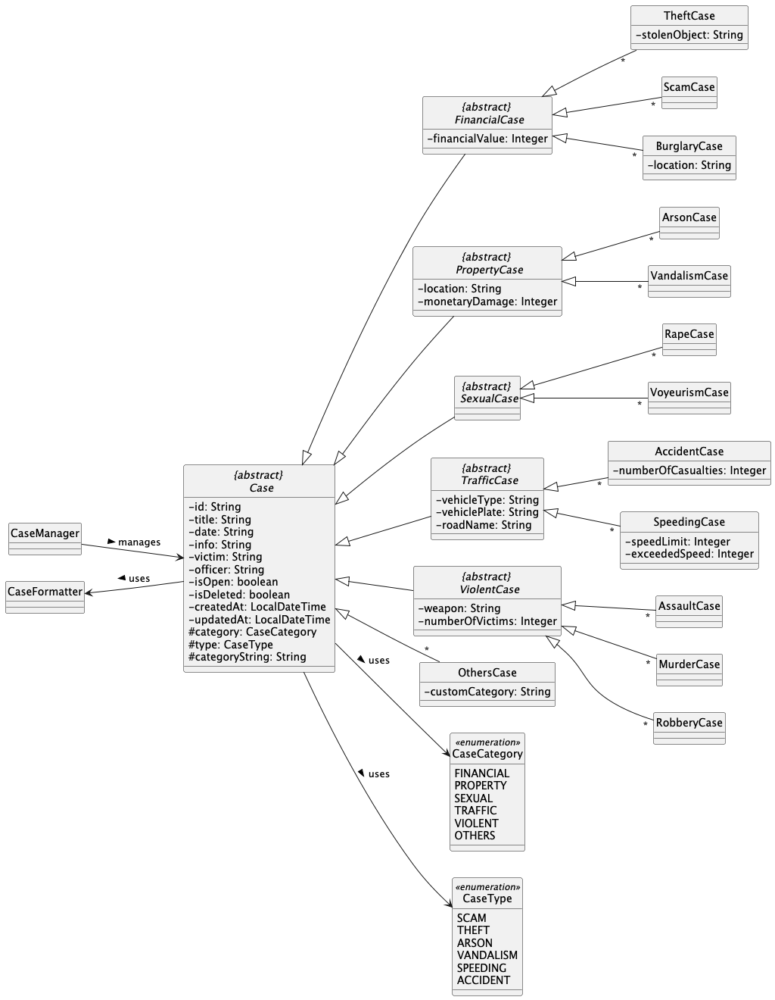
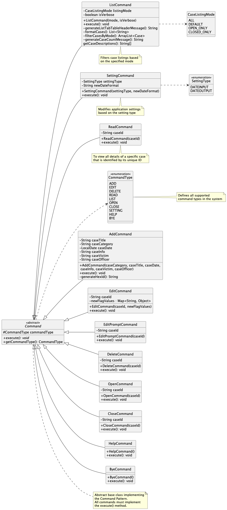
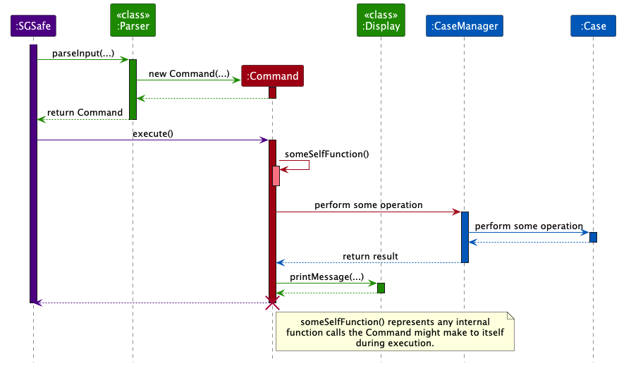
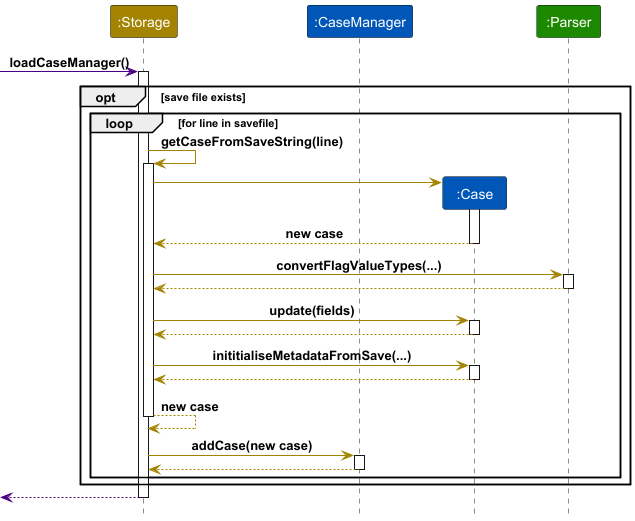
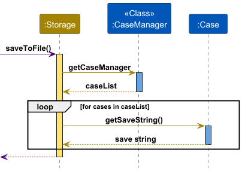
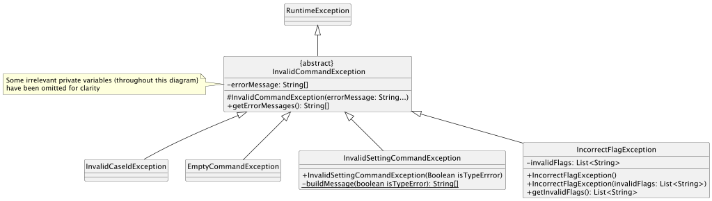

# Developer Guide

## Table of Contents

1. [Acknowledgements](#acknowledgements)
2. [Setting up, Getting Started](#setting-up-getting-started)
3. [Design](#design)
    - [Architecture](#architecture)
    - [UI Component](#ui-component)
    - [CaseFile Component](#casefile-component)
    - [Command Component](#command-component)
    - [Storage Component](#storage-component)
    - [Commons](#Commons)
4. [Implementation](#implementation)
5. [Appendix A: Product Scope](#appendix-a-product-scope)
    - [Target user profile](#target-user-profile)
    - [Value proposition](#value-proposition)
6. [Appendix B: User Stories](#appendix-b-user-stories)
7. [Appendix C: Non-Functional Requirements](#appendix-c-non-functional-requirements)
8. [Appendix D: Glossary](#appendix-d-glossary)
9. [Appendix E: Instructions for Manual Testing](#appendix-e-instructions-for-manual-testing)

---

## Acknowledgements

{list here sources of all reused/adapted ideas, code, documentation, and third-party libraries -- include links to the
original source as well}

---

## Setting up, Getting Started

## Design

### Architecture

The Architecture Diagram given above explains the high-level design of the App.

Given below is a quick overview of main components and how they interact with each other.

#### Overall logic

The main code flow is as follows:

1. Print welcome message
2. Initialize CaseManager with saved info from `data.txt` if it exists
   The main code flow of `SGSafe`, our main class is as follows:
1. Print welcome message using `Display`
2. Initialize CaseManager with saved info from `data.txt` if it exists through `Storage`
3. Read user input from System.in
4. Parse user input using `Parser` and `Validator` to obtain a `Command` object that contains the information necessary
   to execute the specific command
5. Execute user command
6. Save the case info to `data.txt` using `Storage`
7. Until the command is to exit the program, repeat steps 3 to 6
8. Print exit message using `Display`

#### Overall sequence diagram

This is the overall sequence diagram, that will be elaborated more on in detail later.
It describes the rough workflow of our app.
Likewise, the abstract class `Command` mentioned here is meant to be a specific command, depending on what the user
input is.

---

### UI Component
The UI component is responsible for all interactions with the user. It reads user input from the console and displays messages back to the user.

#### Key Classes

**Display**: Handles all user-facing output with formatted messages, including welcome/goodbye messages and command
results.

**Validator**: Provides utility methods to validate flags, check required fields, and verify case ID format.

**Parser**: The parser class serves to determine the type of command object to create based on user input. The parser class extracts the keyword to identify the command type, then calls methods from `Validator` to check if the required arguments are present in the input.

Here are some examples of command keywords and their required arguments:
|keyword|Command Type|Required Arguments|
|-|-|-|
|add|AddCommand|`title`, `category`, `date`, `info`|
|read|ReadCommand||
|delete|DeleteCommand|`case id`|

#### Interaction Flow

1. `SGSafe.mainLoop()` reads user input from console
2. `Parser.parseInput()` extracts the command keyword from the input, then calls `Parser.parseXCommand()`, where X is the appropriate command type
3. `parseXCommand()`calls methods in `Validator` to check input validity, then creates the appropriate `XCommand` object to perform the action
4. Any exceptions caught or error messages are shown through `Display.printMessage()`
5. Results are also displayed via `Display.printMessage()`

##### Example Interaction Flow

The sequence diagram above illustrates how user input is processed to create and execute a `ListCommand`.

---

### CaseFile Component

The CaseFile component is in charge of how case records are stored, organized, and managed in SGSafe.
It acts as the main part of the system’s data model, defining what information each case contains and how cases are handled.
The component’s main functions are provided through the CaseManager class, which other parts of the 
system (like Command and Storage) use to access or update case data.

The API of this component is primarily specified in `CaseManager`.

#### Structure of the CaseFile Component

The CaseFile component consists of two main parts: `Case` and `CaseManager`.
Together, they represent the domain model for managing case records within the system.

The `Case` class defines the structure and behavior of individual cases, 
encapsulating shared attributes such as case ID, case title, case info etc.
Specialised subclasses (e.g., `FinancialCase`, `TrafficCase`, `ViolentCase`) 
extend `Case` to implement category specific attributes and methods.

The `CaseManager` class is responsible for managing `Case` objects.
It provides high-level operations such as adding, updating, deleting, and retrieving cases.

Additionally, `Case` interacts with the `CaseFormatter` class
to produce formatted representations of case data for display.

> ℹ️ Note: Only attributes are shown in the diagram, methods are omitted.\

#### Responsibilities

The CaseFile component:

- **Defines the abstract base class `Case`**, which encapsulates common attributes and behaviors for all case types
- **Provides extensibility** by allowing specialized case types to inherit from `Case`
- **Manages collections of cases** through `CaseManager`, which creates, retrieves, updates, and deletes cases
- **Coordinates persistence** by interacting with the `Storage` component to save and load case data
- **Supports command execution flows**, since `Command` objects often delegate work to `CaseManager` and its managed
  `Case` instances

#### Key Classes

**Case**:
An abstract class that defines the blueprint for all case types.
It includes identifiers, metadata (e.g. time it is created at, time it is updated at, title, etc.), and abstract methods
that must be implemented by subclasses (e.g. domain‑specific case types).

**CaseManager**:
A concrete class responsible for managing Case objects.
It provides operations such as adding, updating, deleting, and retrieving cases.
It also handles validation and persistence by coordinating with Storage.

#### Interaction Flow

1. A `Command.execute()` call triggers an operation on `CaseManager`
2. `CaseManager` locates or creates the appropriate `Case` object
3. The `Case` object performs domain‑specific logic or state changes
4. Results are returned to the Command, which then passes them to the UI for display

---

### Command Component

The command component is responsible for handling user commands. Based on the interpreted user input by parser, it
executes the corresponding
actions on the CaseFile component, and prints result to the UI component.
The API of this component is primarily specified in `Command`.

#### Structure

When a user inputs a command, the UI component uses the `Parser` to create an instance of the appropriate `Command`
subclass.

Each different command is represented by a subclass of the abstract `Command` class, encapsulating the logic for that
specific command. In addition, each command class may have its own attributes to store parameters needed for execution.

The following diagram illustrates the structure of the command component and some of the noteworthy methods in the
commands.

> ℹ️ Note: Only non-trivial fields and methods are shown in the above diagram.\
> ℹ️ UML Info: Due to the limitation of plantUML, the diagram is shown top down for best visibility, instead of the
> usual left to right. 

#### Key Classes

- **Command**: An abstract class that defines the structure for all command classes. It includes an abstract `execute()`
  method that must be implemented by all subclasses.
- **ENUM: SettingType**: An enumeration that defines different settings types that can be modified by the setting
  commands.
- **ENUM: CaseListingMode**: An enumeration that defines different modes for listing cases, such as by date or by
  status.

#### Responsibilities

The command component is the most important part of the application as it contains the logic to handle user commands.
The responsibilities of the command component include:

- Each command class implements the `execute()` method, which contains the logic to perform the command's action.
  Additional methods may be included as needed to support the command's functionality.
- Some commands may validate their parameters before execution to ensure correctness. However, the main input validation
  would have already been performed by the UI component during parsing.
- The command component interacts with the CaseFile component to manipulate case data as required by the command, and it
  uses the UI component to display results or error messages to the user.
- The command component catches any error with command execution and throws appropriate exceptions to be handled by the
  UI component. (example of such errors include trying to edit a non-existent case)

#### Interaction Flow

The following activity diagram illustrates a sample activity flow from the creation of a command to its execution and
result display.

This diagram is an abstract of the [Overall Sequence Diagram](#overall-sequence-diagram) shown earlier, focusing on the
interactions involving the command component.

> ℹ️ Note: The diagram is a generalisation for all commands. Specific commands may have additional interactions or steps
> based on their unique requirements.\
> ℹ️ UML Info: Due to the limitation of plantUML, the lifeline for Command does not end with an X, even though it is
> destroyed after execution.

---

### Storage Component

The Storage component handles the saving and loading from a human editable text file for data persistence

The API of this component is primarily specified in `Storage`.

#### Responsibilities:

The Storage component:

- Handles the writing to and reading from the save file
- Adds saved case files to `CaseManager` on load

#### Interaction flow:

Loading from a save file:

- When the program starts, `loadCaseManager()` from the storage class is called to initialise the `CaseManager`
  from `SGSafe.main()`

Saving to the save file:

- Every time a command completes, `saveToFile()` is run in the `SGsafe.handleUserCommand()` method.
  This only occurs if the command is successfully run.

---

### Commons

#### Exceptions

SGSafe uses a structured exception hierarchy to handle errors gracefully and provide meaningful feedback to users.
The `InvalidCommandException` is the base exception class for all exceptions. This class extend Java's Exception class

The structure of the abstract exception class is as such:

The diagram above does not show all exception classes, but it illustrates the general structure of the exception
hierarchy and show key exception classes with unique fields.

Here are some key points about the exception class structure:

- Each exception class has a private field consisting an array of string `errorMessages` This array is meant to contain
  the messages to be displayed to the user when this exception is thrown.
- Each exception class has a constructor that takes a variable-length argument list that accepts zero or more String
  values. This allows callers to pass multiple error messages as separate arguments without wrapping them in an array.
- Some exception class (inherited from the abstract class) can have additional fields and methods as needed to provide
  more context about the error.
- In the main business logic of the application, when the exception is thrown, we can use the getter `getErrorMessage()`
  method to retrieve the array of string and display it.
- Since `InvalidCommandException` inherits from Java's Exception class, we can treat this as a standard checked
  expression and catch it using try-catch blocks. It can also be implicitly upcasted to Exception type.

---

## Implementation

---

## Appendix A: Product scope

### Target user profile

- police officer who needs to manage a significant number of cases
- prefers desktop apps over other types of apps
- can type fast
- prefers typing to using the mouse
- comfortable using CLI apps

### Value proposition

- manage and track cases faster than a typical mouse/GUI driven app

---

## Appendix B: User Stories

Priorities: High (must have) - `* * *`, Medium (nice to have) - `* *`, Low (unlikely to have) - `*`

| Priorities | Version | As a ...           | I want to ...       | So that I can ...                                    |
|------------|---------|--------------------|---------------------|------------------------------------------------------|
| ***        | v1.0    | front-desk officer | create case         | record cases into the system                         |
| ***        | v1.0    | front-desk officer | edit case details   | edit cases that are typed wrongly                    |
| ***        | v1.0    | front-desk officer | mark case as closed | close cases that have been attended to               |
| ***        | v1.0    | front-desk officer | delete case         | delete duplicates                                    |
| ***        | v1.0    | front-desk officer | list all cases      | see all the cases that are currently being worked on |

---

## Appendix C: Non-Functional Requirements

- Should work on any mainstream OS as long as it has Java 17 or above installed.
- Should be able to hold up to 1000 cases without a noticeable sluggishness in performance for typical usage.
- A user with above average typing speed for regular English text (i.e. not code, not system admin commands) should be
  able to accomplish most of the tasks faster using commands than using the mouse.
  {More to be added}

---

## Appendix D: Glossary

* *glossary item* — Definition

---

## Appendix E: Instructions for manual testing

{Give instructions on how to do a manual product testing e.g., how to load sample data to be used for testing}
