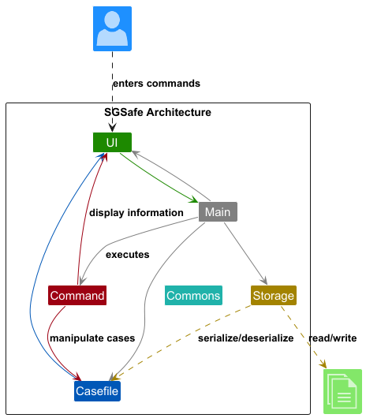
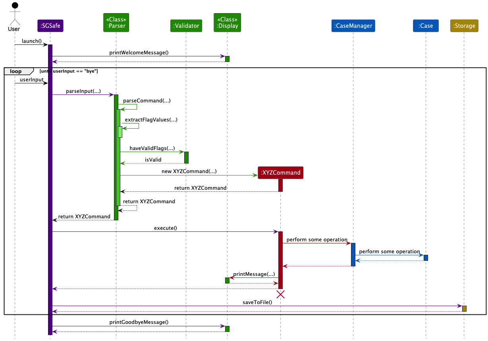

# Developer Guide

## Table of Contents

1. [Acknowledgements](#acknowledgements)
2. [Setting up, Getting Started](#setting-up-getting-started)
3. [Design](#design)
    - [Architecture](#architecture)
    - [UI Component](#ui-component)
    - [CaseFile Component](#casefile-component)
    - [Command Component](#command-component)
    - [Storage Component](#storage-component)
    - [Common](#common)
4. [Implementation](#implementation)
5. [Appendix A: Product Scope](#appendix-a-product-scope)
    - [Target user profile](#target-user-profile)
    - [Value proposition](#value-proposition)
6. [Appendix B: User Stories](#appendix-b-user-stories)
7. [Appendix C: Non-Functional Requirements](#appendix-c-non-functional-requirements)
8. [Appendix D: Glossary](#appendix-d-glossary)
9. [Appendix E: Instructions for Manual Testing](#appendix-e-instructions-for-manual-testing)

---

## Acknowledgements

{list here sources of all reused/adapted ideas, code, documentation, and third-party libraries -- include links to the
original source as well}

---

## Setting up, Getting Started

## Design

### Architecture

The Architecture Diagram given above explains the high-level design of the App.

Given below is a quick overview of main components and how they interact with each other.

#### Overall logic

The main code flow of `SGSafe`, our main class is as follows:
1. Print welcome message using `Display`
2. Initialize CaseManager with saved info from `data.txt` if it exists through `Storage`
3. Read user input from System.in
4. Parse user input using `Parser` and `Validator` to obtain a `Command` object that contains the information necessary to execute the specific command
5. Execute user command
6. Until the command is to exit the program, repeat steps 3 to 5
7. Save the updated list of commands to `data.txt` using `Storage`
8. Print exit message using `Display`

#### Overall sequence diagram
This is the overall sequence diagram, that will be elaborated more on in detail later. 
It describes the rough workflow of our app. 
Likewise, the abstract class `Command` mentioned here is meant to be a specific command, depending on what the user input is.

---

### UI Component

{Add a high-level description of the UI component here}

The API of this component is primarily specified in `{add relevant classes here}`.

#### Structure of the UI Component

The UI consists of three main parts: `Display`, `Parser`, and `Validator`. All these work together to handle user interaction through a console-based command-line interface.

The UI component uses standard input/output streams. The interaction flow is managed in the `SGSafe` main class.

#### Responsibilities

The UI component:

- **Displays formatted output** to the user using `Display`, which wraps messages in visual dividers
- **Parses user commands** using `Parser` to convert raw input into `Command` objects
- **Validates input** using `Validator` to ensure data integrity before execution
- **Keeps a reference to the Command component**, as it relies on Commands to execute user actions
- **Depends on classes in the Domain component**, as it displays `Case` objects from `CaseManager`

#### Key Classes

**Display**: Handles all user-facing output with formatted messages, including welcome/goodbye messages and command results.

**Parser**: Interprets raw input and creates structured `Command` objects by extracting keywords, validating flags, and enforcing input constraints.

**Validator**: Provides utility methods to validate flags, check required fields, and verify case ID format (6-character hexadecimal).

#### Interaction Flow

1. `SGSafe.mainLoop()` reads user input from console
2. `Parser.parseInput()` validates input and creates the appropriate `Command` object
3. `Command.execute()` is called to perform the action
4. Commands interact with `CaseManager` to modify or retrieve `Case` objects
5. Results are displayed via `Display.printMessage()`
6. Exceptions are caught and error messages shown through `Display`

---

### CaseFile Component

{Add a high-level description of the CaseFile component here}

The API of this component is primarily specified in `CaseManager`.

#### Structure of the CaseFile Component

The CaseFile component consists of two main parts: `Case` and `CaseManager`.
Together, they represent the domain model for managing case records within the system.

The Case class defines the structure and behavior of individual cases, while the CaseManager orchestrates their lifecycle and provides higher‑level operations.

#### Responsibilities

The CaseFile component:

- **Defines the abstract base class `Case`**, which encapsulates common attributes and behaviors for all case types
- **Provides extensibility** by allowing specialized case types to inherit from `Case`
- **Manages collections of cases** through `CaseManager`, which creates, retrieves, updates, and deletes cases
- **Coordinates persistence** by interacting with the `Storage` component to save and load case data
- **Supports command execution flows**, since `Command` objects often delegate work to `CaseManager` and its managed `Case` instances

#### Key Classes

**Case**:
An abstract class that defines the blueprint for all case types. 
It includes identifiers, metadata (e.g. time it is created at, time it is updated at, title, etc.), and abstract methods that must be implemented by subclasses (e.g. domain‑specific case types).

**CaseManager**:
A concrete class responsible for managing Case objects. 
It provides operations such as adding, updating, deleting, and retrieving cases. 
It also handles validation and persistence by coordinating with Storage.

#### Interaction Flow
1. A `Command.execute()` call triggers an operation on `CaseManager`
2. `CaseManager` locates or creates the appropriate `Case` object
3. The `Case` object performs domain‑specific logic or state changes
4. Results are returned to the `Command`, which then passes them to the `UI` for display

---

### Command Component

---

### Storage Component

---

### Common

---

## Implementation

---

## Appendix A: Product scope

### Target user profile

- police officer who needs to manage a significant number of cases
- prefers desktop apps over other types of apps
- can type fast
- prefers typing to using the mouse
- comfortable using CLI apps

### Value proposition

- manage and track cases faster than a typical mouse/GUI driven app

---

## Appendix B: User Stories

Priorities: High (must have) - `* * *`, Medium (nice to have) - `* *`, Low (unlikely to have) - `*`

| Priorities | Version | As a ...           | I want to ...           | So that I can ...                                 |
|------------|---------|--------------------|-------------------------|---------------------------------------------------|
| ***        | v1.0    | front-desk officer | create case             | record cases into the system                      |
| ***        | v1.0    | front-desk officer | edit case details       | edit cases that are typed wrongly                 |
| ***        | v1.0    | front-desk officer | mark case as closed     | close cases that have been attended to            |
| ***        | v1.0    | front-desk officer | delete case             | delete duplicates                                 |
| ***        | v1.0    | front-desk officer | list all cases          | see all the cases that are currently being worked on |

---

## Appendix C: Non-Functional Requirements

- Should work on any mainstream OS as long as it has Java 17 or above installed.
- Should be able to hold up to 1000 persons without a noticeable sluggishness in performance for typical usage.
- A user with above average typing speed for regular English text (i.e. not code, not system admin commands) should be able to accomplish most of the tasks faster using commands than using the mouse.
{More to be added}

---

## Appendix D: Glossary

* *glossary item* — Definition

---

## Appendix E: Instructions for manual testing

{Give instructions on how to do a manual product testing e.g., how to load sample data to be used for testing}
